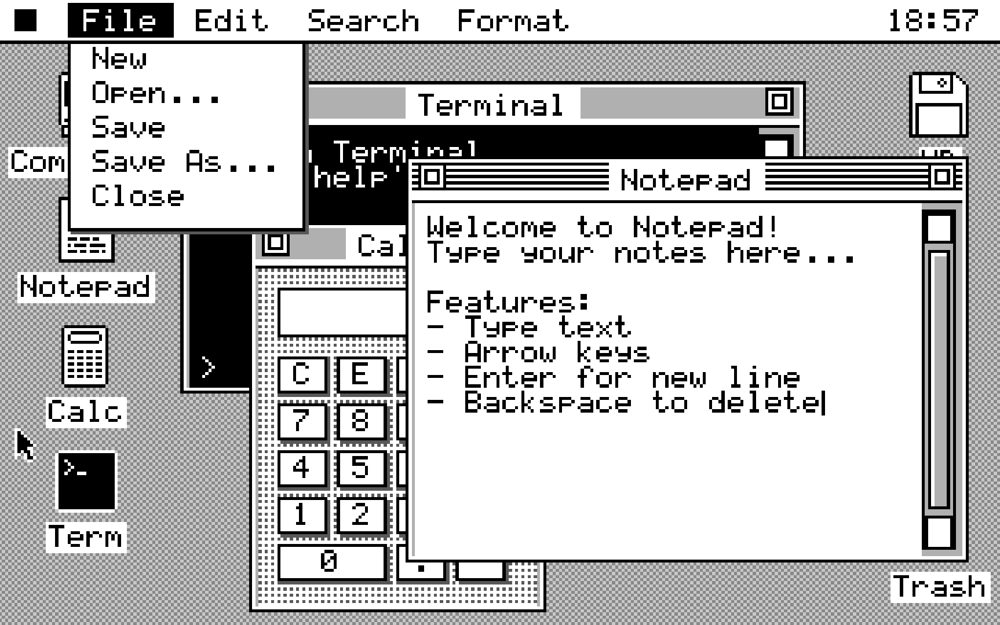
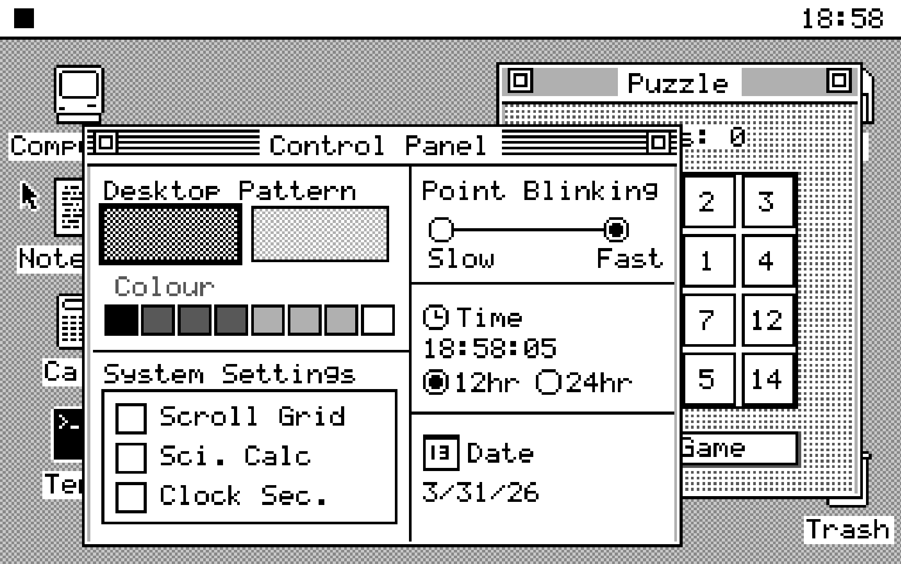
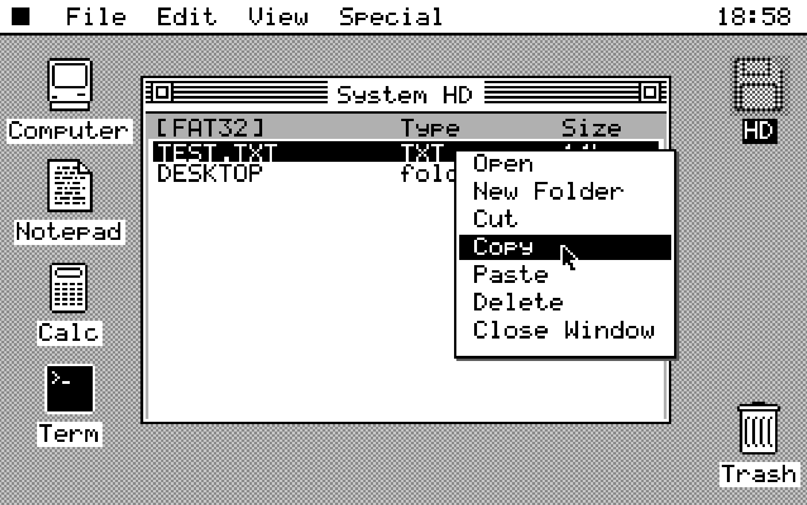
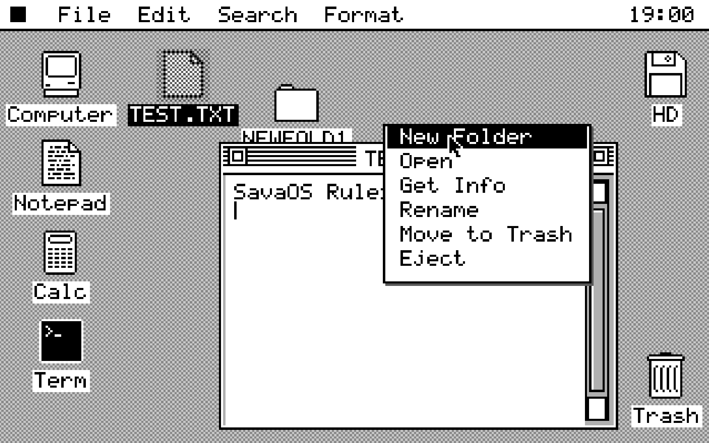

<div align="center">



# SavaOS

**A 32-bit operating system built entirely from scratch — kernel, GUI, drivers, networking, and apps.**

[](LICENSE)


[**Run in QEMU**](#quick-start) · [**Screenshots**](#screenshots) · [**Architecture**](#architecture) · [**Add an App**](#adding-an-application)

</div>

---

SavaOS is a bare-metal x86 operating system written in C and Assembly — no Linux, no POSIX, no borrowed kernel. Everything runs directly on hardware: the window manager, the FAT32 driver, the PS/2 mouse, the RTC clock, a TCP/IP networking stack, and ten bundled applications.

> Built to understand how computers *actually* work.

**Zero dependencies. Boots in QEMU in seconds.**

---

## Screenshots

<div align="center">
 
 
</div>

---

## What's Inside

| Layer | What it does |
|---|---|
| **Bootloader** | GRUB-based, loads kernel via Multiboot1 |
| **Kernel** | Protected mode, IDT, IRQ, PIC, PIT timer |
| **Memory** | Manual heap management, no MMU |
| **Graphics** | VGA Mode 13h, double-buffered, custom 256-color palette |
| **Input** | PS/2 keyboard + mouse drivers |
| **Storage** | ATA/IDE driver + FAT32 read/write (with LFN) + RAM-based VFS |
| **Networking** | RTL8139 driver, TCP/IP stack, DNS, HTTP |
| **Desktop** | Window manager, menu bar, cursor, drag & drop, lasso selection, context menus |
| **Applications** | Notepad, Calculator, Terminal, File Manager, Browser, Pong, Puzzle, Control Panel, Trash, About |

---

## Applications

Ten apps ship with SavaOS, registered through a centralized app registry (`apps.def`).

### 📝 Notepad
Full text editor with undo/redo, copy/paste, find, text selection, `Ctrl+S` save to FAT32 disk. Associates with files opened from the File Manager.

### 🧮 Calculator
Standard and scientific modes. Keyboard input. Handles decimals, negatives, backspace, and clear entry.

### 💻 Terminal
Custom shell with 21 built-in commands — `ls`, `cat`, `touch`, `rm`, `fatls`, `diskinfo`, `fsstate`, and more.

### 📁 File Manager
FAT32 browser: navigate directories, open files, create folders, copy/paste, delete. Full keyboard navigation.

### 🌐 Browser
Web browser powered by the built-in TCP/IP stack. Performs DNS lookups and HTTP GET requests over the RTL8139 network card. Default homepage: `http://theoldnet.com/`

### 🎮 Pong
Classic two-paddle Pong game.

### 🧩 Puzzle
Classic 15-tile sliding puzzle. Shuffles on start, tracks move count, arrow key controls.

### ⚙️ Control Panel
Desktop pattern picker, color chooser, clock settings, system options.

### 🗑️ Trash
Soft-delete files from the desktop. Restore or permanently remove them from the Trash window.

### 💻 About
System information — version, hardware summary, author.

---

## Quick Start

### Prerequisites

```bash
# Ubuntu / Debian / WSL
sudo apt-get install gcc-multilib binutils grub-common grub-pc-bin xorriso qemu-system-x86
```

### Build & Run

```bash
git clone https://github.com/RubenSavytskyi/SavaOS.git
cd SavaOS
make
make run
```

That's it. QEMU opens with a running desktop.

### All Build Targets

| Command | Description |
|---|---|
| `make` | Build `savaos.iso` |
| `make run` | Run in QEMU (auto-detects GTK/SDL) |
| `make run-gtk` | GTK display, zoom-to-fit |
| `make run-sdl` | SDL display |
| `make run-fs` | Fullscreen, no disk image |
| `make run-debug` | GDB stub on port 1234 |
| `make clean` | Remove old build |

---

## Architecture

```
┌───────────────────────────────────────────────────────┐
│                   User Applications                   │
│  Notepad · Calc · Terminal · Browser · Pong · Puzzle  │
├───────────────────────────────────────────────────────┤
│              App Registry (apps.def)                  │
│    Centralized lifecycle, draw, input callbacks       │
├───────────────────────────────────────────────────────┤
│                  Desktop Manager                      │
│   Window manager · Icons · Menus · Drag & drop       │
├───────────────────────────────────────────────────────┤
│                   File System                         │
│          RAM-based VFS  ·  FAT32 (+ LFN)             │
├───────────────────────────────────────────────────────┤
│                  Networking Stack                     │
│         RTL8139 · Ethernet · IP · TCP · DNS          │
├───────────────────────────────────────────────────────┤
│                  Device Drivers                       │
│     VGA · PS/2 KB/Mouse · ATA/IDE · RTC · PIT        │
├───────────────────────────────────────────────────────┤
│                   Kernel Core                         │
│       IDT · IRQ · PIC · Memory · I/O ports           │
├───────────────────────────────────────────────────────┤
│                   x86 Hardware                        │
└───────────────────────────────────────────────────────┘
```

### Memory Layout

```
0x00000000–0x000003FF  Real-mode IVT (unused in PM)
0x00000400–0x00007BFF  BIOS data area (reserved)
0x00007C00–0x00007DFF  Boot sector (512 bytes)
0x00100000–0x002FFFFF  Kernel code + data (2 MB, loaded by GRUB)
0xA0000–0xAFFFF        VGA graphics buffer (64 KB)
0xB8000                VGA text buffer
```

---

## Project Structure

```
savaos/
├── kernel/
│   ├── entry.S                  # Assembly entry point
│   ├── isr.S                    # Interrupt service routines
│   ├── kernel.c                 # Kernel init
│   ├── apps.def                 # Central app registration (X-macro)
│   ├── app_desc.h               # App descriptor struct + callbacks
│   ├── app_registry.c/h         # Runtime app lookup table
│   ├── vga.c/h                  # VGA text mode driver
│   ├── sv_gfx.c/h               # VGA Mode 13h graphics + drawing primitives
│   ├── sv_desktop.c/h           # Desktop + window manager
│   ├── sv_desktop_dispatch.c    # Event dispatch (mouse, menus, overlays)
│   ├── sv_desktop_internal.h    # Internal desktop state
│   ├── gui.c/h                  # Alternate text-mode GUI
│   ├── fs.c/h                   # Virtual File System abstraction
│   ├── fat32.c/h                # FAT32 driver (LFN, alloc, free)
│   ├── ata.c/h                  # ATA/IDE disk driver
│   ├── net.c/h                  # TCP/IP stack (IP, TCP, UDP, DNS, HTTP)
│   ├── rtl8139.c/h              # RTL8139 NIC driver
│   ├── pci.c/h                  # PCI enumeration
│   ├── keyboard.c/h             # PS/2 keyboard
│   ├── mouse.c/h                # PS/2 mouse
│   ├── timer.c/h                # PIT timer
│   ├── rtc.c/h                  # Real-time clock
│   ├── idt.c/h                  # Interrupt descriptor table
│   ├── pic.c/h                  # 8259A PIC (master + slave)
│   └── string.c/h               # kprintf, ksnprintf, kmemcpy, etc.
├── apps/
│   ├── app_about.c/h
│   ├── app_notepad.c/h
│   ├── app_calc.c/h
│   ├── app_terminal.c/h
│   ├── app_disk.c/h
│   ├── app_trash.c/h
│   ├── app_control_panel.c/h
│   ├── app_puzzle.c/h
│   ├── app_browser.c/h
│   └── app_pong.c/h
├── boot/boot.S                  # Boot sector + GDT setup
├── Makefile
└── savaos.iso                   # Bootable ISO
```

---

## Adding an Application

SavaOS uses a centralized X-macro registry — adding an app touches exactly five things.

**1. Register in `kernel/apps.def`:**
```c
APP(myapp)
```
This generates the enum value `APP_myapp` and wires it into the lookup table automatically.

**2. Implement `app_desc_t` in your source file** (e.g. `apps/app_myapp.c`):
```c
#include "app_desc.h"

static void myapp_draw(int id, int cx, int cy, int cw, int ch) {
    vga13_fill_rect(cx, cy, cw, ch, VGA13_WHITE);
    vga13_draw_string(cx + 10, cy + 10, "Hello!", VGA13_BLACK, VGA13_WHITE, 0);
}

const app_desc_t app_myapp_desc = {
    .kind          = APP_myapp,
    .default_title = "My App",
    .def_x = 50, .def_y = 30, .def_w = 200, .def_h = 150,
    .draw          = myapp_draw,
};
```

**3. Declare in `apps/app_myapp.h`:**
```c
extern const app_desc_t app_myapp_desc;
```

**4. (Optional) Add a desktop icon** in `desktop_build_icons()` inside `kernel/sv_desktop.c`:
```c
desktop_add_icon_app("MyApp", APP_myapp, 65, 62);
```

**5. (Optional) Add to the  menu bar** in `menu_sav_items[]` inside `kernel/sv_desktop.c`:
```c
{ "My App", APP_myapp },
```

**6. Add to `Makefile`:**
```makefile
KERNEL_ELF_OBJS += build/app_myapp.o
build/app_myapp.o: apps/app_myapp.c | build
	$(CC) $(CFLAGS) -c -o $@ $<
```

### App Descriptor Callbacks

The `app_desc_t` struct exposes the full lifecycle for an app:

| Callback | When it fires |
|---|---|
| `on_open(id)` | Window created |
| `on_close(id)` | Window closed |
| `draw(id, cx, cy, cw, ch)` | Each frame, clipped to client area |
| `draw_overlay()` | Drawn above all windows (dropdowns, popups) |
| `on_key(id, key)` | Key press while window is active |
| `on_click / on_drag / on_release` | Mouse events in client area |
| `on_right_click` | Right-click in client area |
| `on_menu_action(id, label)` | Menu bar item selected |
| `hit_overlay / hover_overlay / click_overlay` | Overlay hit testing |
| `icon_bmp` | 5×5 pixel icon bitmap |
| `menu_bar_menus / menu_bar_count` | App-specific menu bar entries |

---

## Networking

SavaOS includes a full userspace-style TCP/IP stack running directly in the kernel.

- **RTL8139** NIC driver, detected via PCI enumeration (bus/device/function scan)
- **Ethernet** — ARP (0x0806) and IPv4 (0x0800)
- **IPv4** — fragmentation reassembly, checksum, filtering to `10.0.2.15` / broadcast
- **TCP** — reassembly buffer, basic state machine
- **UDP** — reassembly buffer
- **DNS** — `net_dns_lookup()` resolves hostnames
- **HTTP** — `net_http_get()` performs full GET requests

The Browser app uses these to fetch pages over the QEMU user-mode network (`-netdev user`).

---

## Keyboard Shortcuts

### Notepad
`Ctrl+S` Save · `Ctrl+Z` Undo · `Ctrl+Y` Redo · `Ctrl+C/X/V` Copy/Cut/Paste · `Ctrl+A` Select All · `Home/End` Line start/end · `PgUp/PgDn` Scroll

### File Manager
`↑↓` Navigate · `Enter` Open · `Backspace` Parent dir · `Delete` Delete · `Ctrl+C/V` Copy/Paste

### Calculator
`0–9` Digits · `. ,` Decimal · `+ - * /` Operators · `Enter` Calculate · `Esc` Clear

### Puzzle
`↑ ↓ ← →` Move tiles · `Enter` New game

### Terminal Commands
```
help  clear  echo  about  time  ver  uname
ls  cat  touch  rm
fatls  fatmkdir  fatrm  fatrmdir
diskinfo  fsstate  mounttest  mounttest2  ata test  identifytest
```

---

## Technical Specs

| Property | Value |
|---|---|
| Architecture | x86, 32-bit protected mode |
| Graphics | VGA Mode 13h — 320×200, 256 colors |
| Input | PS/2 keyboard + mouse |
| Storage | ATA/IDE + FAT32 (LFN) + RAM VFS |
| Networking | RTL8139, Ethernet, IPv4, TCP, UDP, DNS, HTTP |
| RAM required | 32 MB |
| Boot | GRUB Multiboot1 |
| Applications | 10 built-in |

---

## Troubleshooting

**`gcc: unrecognized option '-m32'`**
```bash
sudo apt-get install gcc-multilib
```

**Black screen in QEMU**
```bash
qemu-system-i386 -cdrom savaos.iso -vga cirrus
```

**Disk errors / `disk.img` not found**
```bash
qemu-img create -f raw disk.img 64M
```

**GTK/SDL display not working**
```bash
sudo apt-get install libsdl2-dev
make run-curses  # fallback: text mode
```

**GDB won't connect**
```bash
make run-debug
# in another terminal:
gdb -ex "target remote :1234"
```

---

## Roadmap

- [ ] Sound driver (PC speaker / Sound Blaster)
- [ ] Window resizing and minimization
- [ ] ext2 / NTFS read-only support
- [ ] **DOOM port** 🎮
- [ ] Image viewer
- [ ] More terminal commands

---

## Contributing

Pull requests welcome. Most-needed areas:

- **Drivers** — USB, SATA, additional network cards
- **Applications** — image viewer, music player
- **Bug fixes** — especially edge cases in FAT32 and the window manager
- **Documentation** — inline comments, architecture notes

---

## License

MIT — see [LICENSE](LICENSE).

---

## Acknowledgments

- [OSDev Wiki](https://wiki.osdev.org) — the Bible
- Bran's Kernel Development Tutorial
- QEMU and GNU toolchain maintainers
- [theoldnet.com](http://theoldnet.com) — default browser homepage

---

<div align="center">

Made by [Ruben Savytskyi](https://github.com/RubenSavytskyi) · ruvimsavitsky@gmail.com

*If this project helped you understand how operating systems work — give it a ⭐*

</div>
